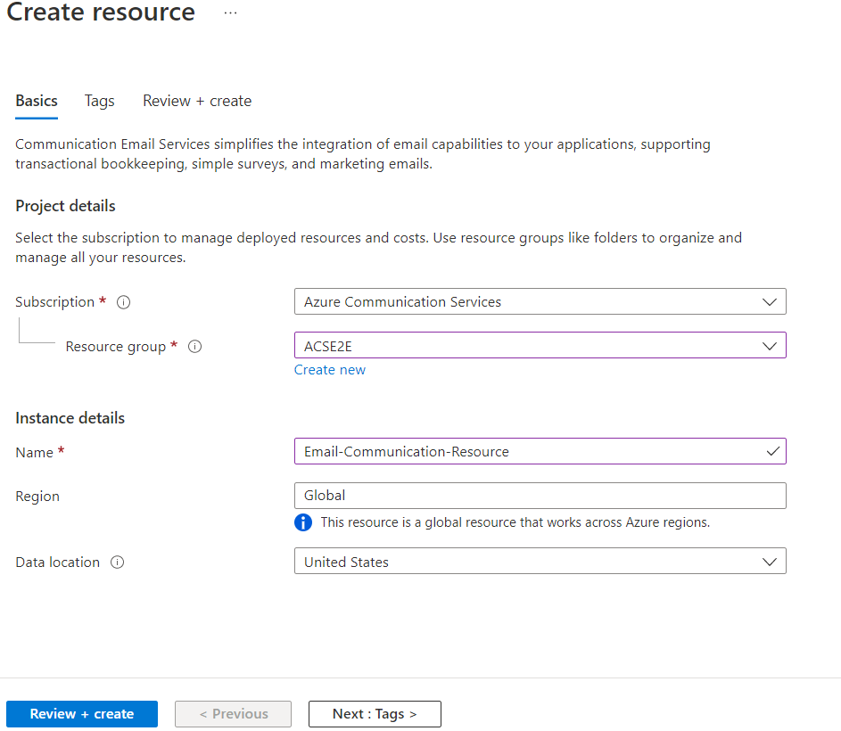

# Building a Multichannel Notification System with Azure Functions and Azure Communication Services
## Introduction

In the interconnected digital era, it's crucial for businesses and services to communicate effectively with their audience. A robust notification system that spans various communication channels can greatly enhance user engagement and satisfaction. This blog post outlines a step-by-step guide on building such a multichannel notification system with Azure Functions and Azure Communication Services.

Leveraging serverless architecture and the reach of Azure Communication Services, your application can dynamically generate and send messages via SMS, Email, and WhatsApp. By incorporating OpenAI GPTs, the system can create content that is not only relevant and timely but personalized, making communication more impactful.


Here are some practical scenarios where a multichannel notification system is valuable:

1. **Financial Alerts**: Banks and financial services can send fraud alerts, transaction confirmations, and account balance updates.
2. **Healthcare Reminders**: Clinics and pharmacies can notify patients about appointment schedules, vaccinations, or prescription refills.
3. **Security Verification**: Services requiring secure authentication can utilize two-factor authentication prompts sent via SMS or WhatsApp.
4. **Marketing and Promotions**: Retailers can craft and distribute targeted marketing messages and promotions, thereby driving customer engagement.
5. **Infrastructure Notifications**: Utility companies can alert customers about service disruptions, maintenance schedules, or conservation tips.
6. **E-commerce Updates**: Online retailers can inform customers about order confirmations, shipping details, and delivery tracking.
7. **Emergency Broadcasting**: Public service agencies can disseminate urgent messages related to safety, natural disasters, or health emergencies.
8. **Event Organization**: Coordinators can send invitations, updates, and feedback requests for various events and conferences.
9. **Customer Support**: Businesses can enhance support by sending automated responses to frequently asked questions or status updates on issues.
10. **Operational Notices**: IT and service departments can alert users to system downtimes, upgrades, or scheduled maintenance.

The foundation of this solution is [Azure Functions](https://docs.microsoft.com/en-us/azure/azure-functions/), a flexible, event-driven platform for running scalable applications with minimal overhead. We will utilize [Azure Communication Services](https://docs.microsoft.com/en-us/azure/communication-services/), which provides reliable APIs for Email, SMS, and WhatsApp messaging. To generate content, we use [OpenAI GPTs](https://openai.com/blog/introducing-gpts), which enables the creation of sophisticated, context-aware text that can be used in notifications.

By following this tutorial, you will gain the knowledge and practical experience necessary to implement a scalable multichannel notification platform that can serve a wide array of communication needs. Let's get started on your path to building a cutting-edge, serverless messaging system on Azure.

## Prerequisites

Before we dive into building our multichannel notification system with Azure Functions and Azure Communication Services, you will need to ensure that you have the following tools and accounts set up:

1. **Azure Account**: You'll need a Microsoft Azure account to create and manage resources on Azure. If you haven't got one yet, you can [create a free account here](https://azure.microsoft.com/en-us/free/).

2. **Visual Studio Code**: We'll be using Visual Studio Code (VS Code) as our Integrated Development Environment (IDE) for writing and debugging our code. Download and install it from [here](https://code.visualstudio.com/).

3. **Azure Functions Extension for Visual Studio Code**: This extension provides you with a seamless experience for developing Azure Functions. It can be installed from the [VS Code marketplace](https://marketplace.visualstudio.com/items?itemName=ms-azuretools.vscode-azurefunctions).

4. **C# Dev Kit**: Since we're writing our Azure Functions in C#, this extension is necessary for getting C# support in VS Code. You can install it from the [VS Code marketplace](https://marketplace.visualstudio.com/items?itemName=ms-dotnettools.csdevkit).

5. **Azure CLI**: The Azure Command-Line Interface(CLI) will be used to create and manage Azure resources from the command line. For installation instructions, visit the Azure CLI installation [documentation page](https://docs.microsoft.com/en-us/cli/azure/install-azure-cli).

6. **Postman**: Although not strictly necessary, Postman is a handy tool for testing our HTTP-triggered Azure Functions without having to write a front-end application. You can download Postman from [getpostman.com](https://www.getpostman.com/).

With the prerequisites in place, you're ready to set up your development environment, which we will cover in the following section.

## Creating Resources

To get started with building a multichannel notification system, we'll need to create several resources within Azure. This section will walk you through setting up your Azure environment using the Azure CLI. Ensure that you have the Azure CLI installed on your machine and that you're logged into your Azure account.

### Azure Communication Services

Azure Communication Services (ACS) provides the backbone for our notification system, allowing us to send SMS, Email, and WhatsApp messages.

1. **Log in to Azure**: 
```bash
az login
```

2. **Create a Resource Group (if necessary)**: This groups all your resources in one collection.
```bash
az group create --name <YourResourceGroupName> --location <PreferredLocation>
```
Replace `<YourResourceGroupName>` with a name for your new resource group and `<PreferredLocation>` with the Azure region you prefer (e.g., `eastus`).

3. **Create ACS Resource**: This will be the main ACS resource where we manage communications capabilities.
```bash
az communication create --name <YourACSResourceName> --location Global --data-location UnitedStates --resource-group <YourResourceGroupName>
```
Replace `<YourACSResourceName>` with a unique name for your ACS resource and `<YourResourceGroupName>` with the name of your resource group.

After creating the resource, retrieve the connection string as you will need it to connect your Azure Function to ACS.

```bash
az communication list-key --name <YourACSResourceName> --resource-group <YourResourceGroupName>
```

### Azure Communication Services for Email

To set up Azure Communication Services Email, you'll need to follow a few steps in the Azure Portal:

1. **Create the Email Communications Service resource using the portal**: Provision a new Email Communication Services resource in [Azure portal](https://portal.azure.com/) using the instructions [here](https://learn.microsoft.com/en-us/azure/communication-services/quickstarts/email/create-email-communication-resource). Make sure to select the same resource group as your ACS resource.


2. **Configure the Email Communications Service**: You will need to configure domains and sender authentication for email. Provision an [Azure Managed Domain](https://learn.microsoft.com/en-us/azure/communication-services/quickstarts/email/add-azure-managed-domains) or set up your [Custom Verified Domain](https://learn.microsoft.com/en-us/azure/communication-services/quickstarts/email/add-custom-verified-domains) depending on your use case.


### Azure Communication Services for SMS

To send SMS messages, you will need to acquire a phone number through ACS.

1. **Get a Phone Number**: Navigate to the **Phone Numbers** blade in your ACS resource on the [Azure portal](https://portal.azure.com/) and follow the steps to [get a phone number](https://learn.microsoft.com/en-us/azure/communication-services/quickstarts/telephony/get-phone-number) that's capable of sending and receiving SMS.

2. **Note the Phone Number**: After acquiring a phone number, note it down as it will be used to send SMS messages from your Azure Function.

### WhatsApp for Business

Sending WhatsApp messages requires setting up a WhatsApp Business account.

1. **Set up a WhatsApp Business Account**: Follow the instructions for connecting a [WhatsApp business account](https://learn.microsoft.com/en-us/azure/communication-services/quickstarts/advanced-messaging/whatsapp/connect-whatsapp-business-account) with Azure Communication Services.

2. **Note the WhatsApp Configuration**: Once set up, make a note of the necessary configuration details such as the phone number and WhatsApp Business API credentials, as they will be needed in your Azure Function.

By following these steps, you will have created the necessary resources to build a multichannel notification system that can reach users through SMS, Email, and WhatsApp. Next, we'll proceed with setting up your Azure Function and integrating these services into it.

## Setting Up Environment

With the prerequisites out of the way, let's prepare our environment to develop our multichannel notification system using Azure Functions and Azure Communication Services.

### Creating the Function App Project

Open Visual Studio Code and follow these steps to create a new Azure Functions project:

1. Click on the Azure icon in the Activity Bar on the side of Visual Studio Code to open the Azure Functions extension.

2. In the Azure Functions extension, click on the 'Create New Project' icon, choose a directory for your project, and select 'Create New Project Here'.


3. Choose the language for your project. We will select C# for this tutorial.

4. Select the template for your first function. For this project, an HTTP-triggered function is a good starting point since we want to receive HTTP requests to send out notifications.

5. Provide a function name, such as `EmailTrigger`, and set the authorization level to anonymous or function, depending on your security preference.

After you have completed these steps, your Azure Functions project will be set up with all the necessary files in the chosen directory.

### Installing the Necessary Packages

Now it’s time to add the packages necessary for integrating Azure Communication Services:

1. Open the integrated terminal in Visual Studio Code by clicking on 'Terminal' in the top menu and then selecting 'New Terminal'.

2. Add the Azure Communication Services packages to your project:

```bash
dotnet add package Azure.Communication.Email
dotnet add package Azure.Communication.Sms
dotnet add package Azure.Communication.Messages --prerelease
```

### Setting Up Environment Variables

You should store configuration details like connection strings and phone numbers as environment variables instead of hardcoding them into your functions. To do so in Azure Functions, add them to the `local.settings.json` file, which is used for local development. 

Edit the `local.settings.json` file to include your Azure Communication Services (ACS) connection string and phone numbers:

```json
{
  "IsEncrypted": false,
  "Values": {
    "AzureWebJobsStorage": "",
    "FUNCTIONS_WORKER_RUNTIME": "dotnet",
    "COMMUNICATION_SERVICES_CONNECTION_STRING": "<acs_connection_string>",
    "SENDER_PHONE_NUMBER": "<acs_sms_phone_number>",
    "WHATSAPP_NUMBER": "<acs_whatsapp_number>",
    "SENDER_EMAIL_ADDRESS": "<acs_email_address>"
  }
}
```

Be sure to replace `<acs_connection_string>`, `<acs_sms_phone_number>`, `<acs_whatsapp_number>`, and `<acs_email_address>` with your actual Azure storage account connection string, Azure Communication Services connection string, SMS phone number, WhatsApp number, and sending email address.

Remember not to commit the `local.settings.json` file to source control if it contains sensitive information. Configure similar settings in the Application Settings for your Azure Function when you deploy to Azure.

## Coding the EmailTrigger

Creating a functional `EmailTrigger` Azure Function involves starting from the default template provided by Azure Functions for C# and enhancing it with the necessary logic and services to handle email sending. In this section, we guide you through the steps to transform the default template into the finished `EmailTrigger` function.

### Step 1: Set Up the Function Template

Start with the default HTTP triggered function template provided by Visual Studio Code after creating an Azure Functions project. This template comes with the necessary usings, a function name attribute, and a simple HTTP trigger. It returns a welcome message as a sign that your function is working.

### Step 2: Add Azure Communication Services Email Reference

Add a reference to `using Azure.Communication.Email` then create a property in the EmailTrigger class to hold an instance of `EmailClient` and a property to hold the email sender address.

```csharp
private readonly EmailClient _emailClient;
private string? sender = Environment.GetEnvironmentVariable("SENDER_EMAIL_ADDRESS");

```

### Step 3: Read Configuration and Initialize EmailClient

Within the `EmailTrigger` class constructor, read the Azure Communication Services connection string from the environment variables using `Environment.GetEnvironmentVariable()` method and initialize an instance of `EmailClient` with the connection string.

Make sure to handle the possibility that the environment variable may be null and throw an appropriate exception if it is not set.

```csharp
string? connectionString = Environment.GetEnvironmentVariable("COMMUNICATION_SERVICES_CONNECTION_STRING");
if (connectionString is null)
{
    throw new InvalidOperationException("COMMUNICATION_SERVICES_CONNECTION_STRING environment variable is not set.");
}
_emailClient = new EmailClient(connectionString);
```

### Step 4: Define the Request Model

Create a request model class `EmailRequest` inside the `EmailTrigger` class to represent the expected payload. This model includes the subject, HTML content, and recipient email address.

```csharp
public class EmailRequest
{
    public string Subject { get; set; } = string.Empty;
    public string HtmlContent { get; set; } = string.Empty;
    public string Recipient { get; set; } = string.Empty;
}
```

### Step 5: Parse the Request Body

Modify the `Run` function to be `async` since we'll be performing asynchronous operations. 
```csharp
public async Task<IActionResult> Run([HttpTrigger(AuthorizationLevel.Anonymous, "post")] HttpRequest req)

```

Use `StreamReader` to read the request body and deserialize it into the `EmailRequest` object using `System.Text.Json.JsonSerializer`.

Handle the case where the deserialization fails by returning a `BadRequestResult`.

```csharp
string requestBody = await new StreamReader(req.Body).ReadToEndAsync();
EmailRequest? data = JsonSerializer.Deserialize<EmailRequest>(requestBody, new JsonSerializerOptions() {
                PropertyNamingPolicy = JsonNamingPolicy.CamelCase
            });
if (data is null)
{
    return new BadRequestResult();
}
```

### Step 6: Define the Sender and Send the Email

Instantiate a sender email address string that will be passed to the `SendAsync` method of the `EmailClient` instance. Replace the static email 'DoNotReply@effaa622-a003-4676-b27e-6b9e7a783581.azurecomm.net' with your configured sender address in the actual implementation.

Use a try-catch block to send the email using the `SendAsync` method and catch any `RequestFailedException` to log any errors.

```csharp
_logger.LogInformation("Sending email...");
EmailSendOperation emailSendOperation = await _emailClient.SendAsync(
    Azure.WaitUntil.Completed,
    sender,
    data.Recipient,
    data.Subject,
    data.HtmlContent
);

_logger.LogInformation($"Email Sent. Status = {emailSendOperation.Value.Status}");
_logger.LogInformation($"Email operation id = {emailSendOperation.Id}");
```

### Step 7: Return a Success Response

Once the email send operation is completed, return an `OkObjectResult` indicating the success of the operation.

```csharp
return new OkObjectResult("Email sent successfully!");

```

### Final Code

After completing all the above steps, your `EmailTrigger` Azure Function should look as follows:

```csharp
using System;
using System.IO;
using System.Text.Json;
using System.Threading.Tasks;
using Azure;
using Azure.Communication.Email;
using Microsoft.AspNetCore.Mvc;
using Microsoft.Azure.Functions.Worker;
using Microsoft.Extensions.Logging;

namespace ACSGPTFunctions
{
    public class EmailTrigger
    {
        private readonly ILogger<EmailTrigger> _logger;
        private readonly EmailClient _emailClient;

        public EmailTrigger(ILogger<EmailTrigger> logger)
        {
            _logger = logger;
            string? connectionString = Environment.GetEnvironmentVariable("COMMUNICATION_SERVICES_CONNECTION_STRING");
            if (connectionString is null)
            {
                throw new InvalidOperationException("COMMUNICATION_SERVICES_CONNECTION_STRING environment variable is not set.");
            }
            _emailClient = new EmailClient(connectionString);
        }

        public class EmailRequest
        {
            public string Subject { get; set; } = string.Empty;
            public string HtmlContent { get; set; } = string.Empty;
            public string Recipient { get; set; } = string.Empty;
        }

        [Function("EmailTrigger")]
        public async Task<IActionResult> Run([HttpTrigger(AuthorizationLevel.Anonymous, "post")] HttpRequest req)
        {
            _logger.LogInformation("Processing request.");

            string requestBody = await new StreamReader(req.Body).ReadToEndAsync();
            EmailRequest? data = JsonSerializer.Deserialize<EmailRequest>(requestBody, new JsonSerializerOptions() {
                PropertyNamingPolicy = JsonNamingPolicy.CamelCase
            });

            if (data is null)
            {
                return new BadRequestResult();
            }

            var sender = "DoNotReply@effaa622-a003-4676-b27e-6b9e7a783581.azurecomm.net";

            try
            {
                _logger.LogInformation("Sending email...");
                EmailSendOperation emailSendOperation = await _emailClient.SendAsync(
                    Azure.WaitUntil.Completed,
                    sender,
                    data.Recipient,
                    data.Subject,
                    data.HtmlContent
                );

                _logger.LogInformation($"Email Sent. Status = {emailSendOperation.Value.Status}");
                _logger.LogInformation($"Email operation id = {emailSendOperation.Id}");
            }
            catch (RequestFailedException ex)
            {
                _logger.LogInformation($"Email send operation failed with error code: {ex.ErrorCode}, message: {ex.Message}");
                return new ObjectResult(new { error = ex.Message }) { StatusCode = 500 };
            }

            return new OkObjectResult("Email sent successfully!");
        }
    }
}
```

This completed `EmailTrigger` Azure Function is now ready to be part of a multichannel notification system, handling the email communication channel.

## Coding the SMSTrigger

Enhancing the `SMSTrigger` Azure Function from the default template involves a series of steps. These steps will transform the basic Function into one that can send SMS messages using Azure Communication Services. Below is a guide to get you from the default HTTP triggered function to the finished `SMSTrigger`.

### Step 1: Set Up the Function Template

Start by using the default HTTP triggered function template provided by Visual Studio Code for creating an Azure Functions project. It will have the necessary usings, function name attribute, and a simple HTTP trigger that returns a welcome message. Select your project in the Workspace pane, and click on the 'Create Function' button in the Azure Functions extension. Choose 'HTTP trigger' as the template and provide a name for the function, such as `SMSTrigger`. Set the authorization level to anonymous or function, depending on your security preference.


### Step 2: Add Azure Communication Services Email Reference

Add a reference to `using Azure.Communication.Sms` then create a property in the SMSTrigger class to hold an instance of `SmsClient` and a property to hold the email sender address.

```csharp
private readonly SmsClient _smsClient;
private string? sender = Environment.GetEnvironmentVariable("SENDER_PHONE_NUMBER");

```

### Step 3: Read Configuration and Initialize SmsClient

In the constructor of the `SMSTrigger` class, read the Azure Communication Services connection string from the environment variables using the `Environment.GetEnvironmentVariable()` method and initialize the `SmsClient` instance.

Be sure to check if the connection string is null, and if so, throw an exception to indicate that the environment variable is missing:

```csharp
string? connectionString = Environment.GetEnvironmentVariable("COMMUNICATION_SERVICES_CONNECTION_STRING");
if (connectionString is null)
{
    throw new InvalidOperationException("COMMUNICATION_SERVICES_CONNECTION_STRING environment variable is not set.");
}
_smsClient = new SmsClient(connectionString);
```

### Step 4: Define the Request Model

Create a request model class within the `SMSTrigger` class called `SmsRequest`. This model should contain properties for the message text and the phone number to which the message will be sent.

```csharp
public class SmsRequest
{
    public string Message { get; set; } = string.Empty;
    public string PhoneNumber { get; set; } = string.Empty;
}
```

### Step 5: Parse the Request Body

Change the `Run` function to be `async` as we will perform asynchronous operations. Use a `StreamReader` to read the request body as a string and deserialize it into an `SmsRequest` object using `JsonSerializer`.

```csharp
        public async Task<IActionResult> Run([HttpTrigger(AuthorizationLevel.Anonymous, "post")] HttpRequest req)
```

If the request body fails to deserialize into `SmsRequest`, return a `BadRequestResult`:

```csharp
string requestBody = await new StreamReader(req.Body).ReadToEndAsync();
SmsRequest? data = JsonSerializer.Deserialize<SmsRequest>(requestBody, new JsonSerializerOptions() {
                PropertyNamingPolicy = JsonNamingPolicy.CamelCase
            });
if (data is null)
{
    return new BadRequestResult();
}
```

### Step 6: Define the Sender and Send an SMS

Retrieve the sender's phone number from the environment variables with `Environment.GetEnvironmentVariable()`. Then, attempt to send the SMS with a try-catch block, handling any `RequestFailedException` that may occur and logging the relevant information:

```csharp
try
{
    _logger.LogInformation("Sending SMS...");
    SmsSendResult smsSendResult = await _smsClient.SendAsync(
        sender,
        data.PhoneNumber,
        data.Message
    );

    _logger.LogInformation($"SMS Sent. Successful = {smsSendResult.Successful}");
    _logger.LogInformation($"SMS operation id = {smsSendResult.MessageId}");
}
catch (RequestFailedException ex)
{
    _logger.LogInformation($"SMS send operation failed with error code: {ex.ErrorCode}, message: {ex.Message}");
    // Return an appropriate error response if needed
}
```

### Step 7: Return a Success Response

If sending the SMS is successful, return an `OkObjectResult` to the caller indicating that the SMS has been sent.

```csharp
return new OkObjectResult("SMS sent successfully!");
```

### Final Code

The final `SMSTrigger` Azure Function, with the steps implemented, should look as follows:

```csharp
using System;
using System.IO;
using System.Threading.Tasks;
using Microsoft.AspNetCore.Http;
using Microsoft.AspNetCore.Mvc;
using Microsoft.Azure.Functions.Worker;
using Microsoft.Extensions.Logging;
using Azure;
using Azure.Communication.Sms;
using System.Text.Json;

namespace ACSGPTFunctions
{
    public class SMSTrigger
    {
        private readonly ILogger<SMSTrigger> _logger;
        private readonly SmsClient _smsClient;
        private string? sender = Environment.GetEnvironmentVariable("SENDER_PHONE_NUMBER");

        public SMSTrigger(ILogger<SMSTrigger> logger)
        {
            _logger = logger;
            string? connectionString = Environment.GetEnvironmentVariable("COMMUNICATION_SERVICES_CONNECTION_STRING");
            if (connectionString is null)
            {
                throw new InvalidOperationException("COMMUNICATION_SERVICES_CONNECTION_STRING environment variable is not set.");
            }
            _smsClient = new SmsClient(connectionString);
        }

        public class SmsRequest
        {
            public string Message { get; set; } = string.Empty;
            public string PhoneNumber { get; set; } = string.Empty;
        }

        [Function("SmsTrigger")]
        public async Task<IActionResult> Run([HttpTrigger(AuthorizationLevel.Anonymous, "post")] HttpRequest req)
        {
            _logger.LogInformation("Processing request.");

            // Read the request body
            string requestBody = await new StreamReader(req.Body).ReadToEndAsync();

            // Try to deserialize the request body into an SmsRequest object
            SmsRequest? data = JsonSerializer.Deserialize<SmsRequest>(requestBody, new JsonSerializerOptions() {
                PropertyNamingPolicy = JsonNamingPolicy.CamelCase
            });

            // If the deserialization failed or the data is null, return a 400 Bad Request response
            if (data is null)
            {
                return new BadRequestResult();
            }

            // Try to send the SMS
            try
            {
                _logger.LogInformation("Sending SMS...");
                SmsSendResult smsSendResult = await _smsClient.SendAsync(
                    sender,
                    data.PhoneNumber,
                    data.Message
                );

                _logger.LogInformation($"SMS Sent. Successful = {smsSendResult.Successful}");
                _logger.LogInformation($"SMS operation id = {smsSendResult.MessageId}");
            }
            catch (RequestFailedException ex)
            {
                _logger.LogInformation($"SMS send operation failed with error code: {ex.ErrorCode}, message: {ex.Message}");
                return new ObjectResult(new { error = ex.Message }) { StatusCode = 500 };
            }

            return new OkObjectResult("SMS sent successfully!");
        }
    }
}
```

This completed `SMSTrigger` Azure Function can now facilitate SMS as part of your multichannel notification system. 

## Coding the WhatsAppTrigger

Creating a functional `WhatsAppTrigger` Azure Function involves iterating on the default HTTP-triggered function template provided by Azure Functions for C#. We will modify this template to integrate Azure Communication Services for sending WhatsApp messages via template messages. Follow the steps below to transform this template into a complete `WhatsAppTrigger` function:

### Step 1: Set Up the Function Template

Start with the default HTTP-triggered function template provided by Visual Studio Code after creating an Azure Functions project. This template includes necessary usings, a function name attribute, and a basic HTTP trigger. It returns a simple welcome message, indicating your function is running. Select your project in the Workspace pane, and click on the 'Create Function' button in the Azure Functions extension. Choose 'HTTP trigger' as the template and provide a name for the function, such as `WhatsAppTrigger`. Set the authorization level to anonymous or function, depending on your security preference.

### Step 2: Reference the Azure Communication Services Messages Package

Ensure the `Azure.Communication.Messages` NuGet package is included in your project to enable messaging features needed for WhatsApp. Install the package with the following command in Visual Studio Code’s terminal:

```bash
dotnet add package Azure.Communication.Messages --prerelease
```

Add a reference to `using Azure.Communication.Messages` then create a property in the WhatsAppTrigger class to hold an instance of `NotificationMessagesClient` and a property to hold the WhatsApp identifier.

```csharp
private readonly NotificationMessagesClient _messagesClient;
private string? sender = Environment.GetEnvironmentVariable("WHATSAPP_NUMBER");

```

### Step 3: Read Configuration and Initialize NotificationMessagesClient

Update the `WhatsAppTrigger` class constructor to read the Azure Communication Services connection string from environment variables using `Environment.GetEnvironmentVariable()` and initialize `NotificationMessagesClient` with this connection string:

```csharp
string? connectionString = Environment.GetEnvironmentVariable("COMMUNICATION_SERVICES_CONNECTION_STRING");
if (connectionString is null)
{
    throw new InvalidOperationException("COMMUNICATION_SERVICES_CONNECTION_STRING environment variable is not set.");
}
_messagesClient = new NotificationMessagesClient(connectionString);
```

### Step 4: Define the Request Model

Create a request model class named `WhatsAppRequest` within the `WhatsAppTrigger` class, containing properties for the destination phone number, template name, language, and template parameters:

```csharp
public class WhatsAppRequest
{
    public string PhoneNumber { get; set; } = string.Empty;
    public string TemplateName { get; set; } = "appointment_reminder";
    public string TemplateLanguage { get; set; } = "en";
    public List<string> TemplateParameters { get; set; } = new List<string>();
}
```

### Step 5: Parse the Request Body

Convert the `Run` function to be `async` to enable asynchronous work. Use `StreamReader` to read the request body and deserialize it to a `WhatsAppRequest` instance using `System.Text.Json.JsonSerializer` with `JsonNamingPolicy.CamelCase`.

```csharp
        public async Task<IActionResult> Run([HttpTrigger(AuthorizationLevel.Anonymous, "post")] HttpRequest req)
```


Handle potential deserialization failure by returning `BadRequestResult`:

```csharp
string requestBody = await new StreamReader(req.Body).ReadToEndAsync();
WhatsAppRequest? data = JsonSerializer.Deserialize<WhatsAppRequest>(requestBody, new JsonSerializerOptions() {
    PropertyNamingPolicy = JsonNamingPolicy.CamelCase
});

if (data is null)
{
    return new BadRequestResult();
}
```

### Step 6: Prepare Template Message and Send WhatsApp Message

Modify the try-catch block to construct a `SendMessageOptions` object using `MessageTemplateWhatsAppBindings` and `MessageTemplate`, and then make a call to `_messagesClient.SendMessageAsync(sendTemplateMessageOptions)`:

```csharp
try
{
    _logger.LogInformation("Sending WhatsApp message...");

    List<string> recipientList = new List<string> { data.PhoneNumber };
    List<MessageTemplateText> values = data.TemplateParameters
        .Select((parameter, index) => new MessageTemplateText($"value{index + 1}", parameter))
        .ToList();
    MessageTemplateWhatsAppBindings bindings = new MessageTemplateWhatsAppBindings(
        body: values.Select(value => value.Name).ToList()
    );
    MessageTemplate template = new MessageTemplate(data.TemplateName, data.TemplateLanguage, values, bindings);
    SendMessageOptions sendTemplateMessageOptions = new SendMessageOptions(sender, recipientList, template);
    Response<SendMessageResult> templateResponse = await _messagesClient.SendMessageAsync(sendTemplateMessageOptions);
    
    _logger.LogInformation("WhatsApp message sent successfully!");
}
catch (RequestFailedException ex)
{
    _logger.LogError($"WhatsApp send operation failed with error code: {ex.ErrorCode}, message: {ex.Message}");
    return new ObjectResult(new { error = ex.Message }) { StatusCode = 500 };
}
```

### Step 7: Return Success Response

After sending the WhatsApp message successfully, return an `OkObjectResult` stating "WhatsApp sent successfully!". 

```csharp
            return new OkObjectResult("WhatsApp sent successfully!");
```

### Final Code

Following the described steps, the final `WhatsAppTrigger` Azure Function should look like this:

```csharp
using Microsoft.AspNetCore.Http;
using Microsoft.AspNetCore.Mvc;
using Microsoft.Azure.Functions.Worker;
using Microsoft.Extensions.Logging;

using Azure;
using Azure.Communication.Messages;
using System.Text.Json;
using System.IO;
using System.Threading.Tasks;
using System.Linq;
using System.Collections.Generic;

namespace ACSGPTFunctions
{
    public class WhatsAppTrigger
    {
        private readonly ILogger<WhatsAppTrigger> _logger;
        private readonly NotificationMessagesClient _messagesClient;
        private string? sender = Environment.GetEnvironmentVariable("WHATSAPP_NUMBER");

        public WhatsAppTrigger(ILogger<WhatsAppTrigger> logger)
        {
            _logger = logger;
            string? connectionString = Environment.GetEnvironmentVariable("COMMUNICATION_SERVICES_CONNECTION_STRING");
            if (connectionString is null)
            {
                throw new InvalidOperationException("COMMUNICATION_SERVICES_CONNECTION_STRING environment variable is not set.");
            }
            _messagesClient = new NotificationMessagesClient(connectionString);
        }

        public class WhatsAppRequest
        {
            public string PhoneNumber { get; set; } = string.Empty;
            public string TemplateName { get; set; } = "appointment_reminder";
            public string TemplateLanguage { get; set; } = "en";
            public List<string> TemplateParameters { get; set; } = new List<string>();
        }

        [Function("WhatsAppTrigger")]
        public async Task<IActionResult> Run([HttpTrigger(AuthorizationLevel.Function, "get", "post")] HttpRequest req)
        {
            _logger.LogInformation("Processing request.");

            string requestBody = await new StreamReader(req.Body).ReadToEndAsync();
            WhatsAppRequest? data = JsonSerializer.Deserialize<WhatsAppRequest>(requestBody, new JsonSerializerOptions() {
                PropertyNamingPolicy = JsonNamingPolicy.CamelCase
            });

            if (data is null)
            {
                return new BadRequestResult();
            }

            var recipientList = new List<string> { data.PhoneNumber };
            var values = data.TemplateParameters
                .Select((parameter, index) => new MessageTemplateText($"value{index + 1}", parameter))
                .ToList();
            var bindings = new MessageTemplateWhatsAppBindings(
                body: values.Select(value => value.Name).ToList()
            );
            var template = new MessageTemplate(data.TemplateName, data.TemplateLanguage, values, bindings);
            var sendTemplateMessageOptions = new SendMessageOptions(sender, recipientList, template);

            try
            {
                Response<SendMessageResult> templateResponse = await _messagesClient.SendMessageAsync(sendTemplateMessageOptions);
                _logger.LogInformation("WhatsApp message sent successfully!");
            }
            catch (RequestFailedException ex)
            {
                _logger.LogError($"WhatsApp send operation failed with error code: {ex.ErrorCode}, message: {ex.Message}");
                return new ObjectResult(new { error = ex.Message }) { StatusCode = 500 };
            }
            return new OkObjectResult("WhatsApp sent successfully!");
        }
    }
}
```

The `WhatsAppTrigger` Azure Function is now ready to send WhatsApp template messages. Be sure to test it extensively, and remember to handle any issues related to input validation and communicate with the Azure Communication Services API correctly.

## Deployment and Testing

After developing the multichannel notification system using Azure Functions, the next important step is to deploy and test the functions to ensure that they work as expected. This section will guide you through deploying your Azure Function to the cloud and testing the Email, SMS, and WhatsApp triggers.

### Deploying the Azure Function

Deployment of your Azure Function can be done right from Visual Studio Code with the Azure Functions extension.

1. **Publish the Function App**: In Visual Studio Code, sign in to Azure if you haven't already. In the Azure Functions extension tab, find the 'Deploy to Function App...' button and select it.


2. **Choose Your Function App**: You can either create a new Function App or deploy to an existing one. If it's the first time you are deploying, choose 'Create New Function App in Azure...'.

3. **Set the Configuration**: Provide a unique name for your Function App, select a runtime stack (.NET Core in this case), choose the appropriate region, and confirm your selections.

4. **Wait for Deployment**: The deployment process will take a few minutes. Monitor the output window for completion status and any potential errors.

### Set Up Application Settings

After deployment, you need to configure the application settings (environment variables) in Azure.

1. **Open the Function App**: Navigate to the [Azure Portal](https://portal.azure.com/), and find your Function App under 'All Resources' or by searching the name you provided.

2. **Access Application Settings**: In the Function App's menu, go to 'Configuration' under the 'Settings' section.

3. **Add the Settings**: Click on 'New application setting' and add the key-value pairs for the environment variables specified in your `local.settings.json`: `COMMUNICATION_SERVICES_CONNECTION_STRING`, `SENDER_EMAIL_ADDRESS`, `SENDER_PHONE_NUMBER`, `WHATSAPP_NUMBER`, etc.,

```json
{
  "IsEncrypted": false,
  "Values": {
    "AzureWebJobsStorage": "",
    "FUNCTIONS_WORKER_RUNTIME": "dotnet-isolated",
    "COMMUNICATION_SERVICES_CONNECTION_STRING": "<<connection string>>",
    "SENDER_PHONE_NUMBER": "<<phone number>>",
    "SENDER_EMAIL_ADDRESS": "<<email address>>",
    "WHATSAPP_NUMBER":"<<WhatsApp id>>"
  }
}
```

4. **Save and Restart**: After adding the required settings, make sure to save the configurations and restart the Function App to ensure the new settings take effect.

Alternatively, when the Function has finished deploying, you can click on 'Upload settings' to upload your settings from local.settings.json. Don't forget to restart the Function App after uploading the settings.


### Testing the Function

With the deployment complete and the environment configured, it's time to verify that your function works as intended through each communication channel.

#### Testing Email Notifications

To test the `EmailTrigger` function:

1. **Send an HTTP POST Request**: Use a tool like Postman to send a POST request to the Function App's URL suffixed with `/api/EmailTrigger`. The body should contain JSON with keys for `subject`, `htmlContent`, and `recipient`.

2. **Verify Email Receipt**: Check the recipient's email inbox for the message. Ensure that the subject and content match what you sent through the POST request.

#### Testing SMS Notifications

To test the `SMSTrigger` function:

1. **Send an HTTP POST Request**: Using Postman, send a POST request to the Function App's URL with `/api/SMSTrigger` at the end. The body of your request should contain JSON with `message` and `phoneNumber` keys.

2. **Check for SMS**: Ensure that the specified phone number receives the SMS and the message content matches the request.

#### Testing WhatsApp Notifications

To test the `WhatsAppTrigger` function:

1. **Send an HTTP POST Request**: Use Postman again to POST to the Function URL, this time ending with `/api/WhatsAppTrigger`. Include a JSON body with keys for `phoneNumber`, `templateName`, `templateLanguage`, and `templateParameters`.

2. **Confirm WhatsApp Message**: Verify that the WhatsApp message reaches the intended recipient with correct template filling.

## Step 9: Integrate with OpenAI GPTs
At [OpenAI GPTs editor](https://chat.openai.com/gpts/editor), click 'new GPT' and 'configure'. Name it "Email Sender" and set the description and instructions as mentioned.
```
Compose wonderful emails and send them
```
```
Help author short and delightful emails. Ask for details on the nature of the email content and include creative ideas for topics. Compose the email with placeholders for the sender's name and receiver's name. You do not need a full name. Share a draft of the email and ask for the sender's name, and the receiver's name and email address. Provide a draft of the final email and confirm the user is happy with it. When the user provides a recipient's email address ask if it is correct before sending. Do not send the email until you provide a final draft and you have a confirmed recipient email address.
```


## Step 10: Add Actions and JSON Schema
Click 'Create new action' in your GPT configuration. Enter the following JSON:
```json
{
  "openapi": "3.1.0",
  "info": {
    "title": "Send Message API",
    "description": "API for sending a message to a specified email address.",
    "version": "v1.0.0"
  },
  "servers": [
    {
      "url": "https://<<function-app-url>>.azurewebsites.net"
    }
  ],
   "paths": {
    "/api/emailtrigger": {
      "post": {
        "description": "Send a message to a given email address",
        "operationId": "SendMessage",
        "requestBody": {
          "required": true,
          "content": {
            "application/json": {
              "schema": {
                "type": "object",
                "properties": {
                  "recipient": {
                    "type": "string",
                    "format": "email",
                    "description": "Email address of the recipient"
                  },
                  "subject": {
                    "type": "string",
                    "description": "The message subject"
                  },
                  "htmlContent": {
                    "type": "string",
                    "description": "The body content of the email encoded as escaped HTML"
                  }
                },
                "required": [
                  "to",
                  "message"
                ]
              }
            }
          }
        },
        "deprecated": false
      }
    }
  },
  "components": {
    "schemas": {}
  }
}
```

Leave Authentication to none, and Privacy Policy blank
## Step 11: Test Your GPT
Finally, try out your GPT in the preview pane to see it in action!

By following these steps, you can easily integrate Azure Communication Services with OpenAI GPTs to send emails effortlessly.


## Conclusion and Further Reading

We have successfully walked through the journey of building a serverless multichannel notification system using Azure Functions and Azure Communication Services. This system is capable of sending timely and personalized notifications across multiple channels, such as Email, SMS, and WhatsApp. In addition, we have explored how to enhance our system with sophisticated content generation capabilities using OpenAI GPTs.

The modular nature of the Azure Functions framework allows your application to scale and adapt easily to changing requirements and traffic demands. Meanwhile, Azure Communication Services enrich the user experience by meeting customers on their preferred platforms, contributing to a seamless and cohesive communication strategy.

As developers, there's always room to expand our knowledge and add robust features to our applications. Here are some suggestions for further exploration and resources that can assist you in taking your applications to the next level:

1. **Azure Functions Best Practices**: Learn about best practices for designing and implementing Azure Functions by visiting [Azure Functions best practices](https://docs.microsoft.com/azure/azure-functions/functions-best-practices).

2. **Azure Communication Services Documentation**: Explore the full capabilities of Azure Communication Services including chat, phone numbers, video calling, and more on the [Azure Communication Services documentation](https://docs.microsoft.com/azure/communication-services/).

3. **Security and Compliance in Azure**: Understand the best practices for security and compliance in Azure applications, particularly relevant for handling sensitive user communication data. Check the [Microsoft Azure Trust Center](https://azure.microsoft.com/support/trust-center/).

4. **OpenAI GPT Documentation**: For more insight into using and customizing OpenAI GPTs, refer to the [OpenAI API documentation](https://beta.openai.com/docs/).

5. **Azure AI Services**: Azure offers a range of AI services beyond just communication. Explore Azure AI services for more advanced scenarios such as speech recognition, machine translation, and anomaly detection at [Azure AI services documentation](https://docs.microsoft.com/azure/ai/).

6. **Handling Large-scale Data**: To handle a large amount of data and improve the performance of communication systems, consider learning about Azure's data-handling services like Azure Cosmos DB, Azure SQL Database, and Azure Cache for Redis. Start with the [Azure Data storage documentation](https://docs.microsoft.com/azure/storage/).

7. **Monitoring and Diagnostics**: Improve the reliability of your applications by implementing robust monitoring and diagnostics tools. Azure offers several tools such as Azure Monitor and Application Insights. Dive into [Application Insights for Azure Functions](https://docs.microsoft.com/azure/azure-functions/functions-monitoring).

8. **Serverless Workflow Automation with Azure Logic Apps**: Enhance your serverless applications using Azure Logic Apps to automate and simplify workflows. Learn more about Azure Logic Apps at [What is Azure Logic Apps?](https://docs.microsoft.com/azure/logic-apps/logic-apps-overview).

We encourage you to continue exploring and experimenting with Azure services and OpenAI GPTs to build more personalized and efficient communication solutions. The robust feature set of Azure paired with the advanced capabilities of GPTs offers an exciting landscape for developing innovative applications.

We'd love to hear your feedback on this tutorial. Share your thoughts and any additional resources you've found helpful in creating solutions with Azure Functions and Azure Communication Services. Engage with the Azure developer community, contribute ideas, and collaborate on projects to keep on advancing in the rapidly evolving field of cloud-based systems. Happy coding!
